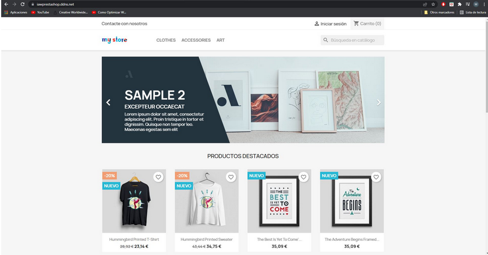

# **Práctica Prestashop:** Instalación de PrestaShop usando contenedores Docker y Docker Compose

En esta práctica tendremos que realizar la implantación de un sitio PrestaShop en Amazon Web Services (AWS) haciendo uso de contenedores Docker y la herramienta Docker Compose.
Requisitos de la máquina virtual Amazon EC2.

Debemos asegurarnos de que la máquina disponga de:

- 2 GB de memoria RAM.
- Asignamos 20 GB de almacenamiento en el disco duro.

## Instalación y configuración de Docker y Docker compose

En primer lugar deberemos instalar Docker, para ello ejecutamos el script *docker.sh*, el cuál descarga Docker, añade nuestro usuario al grupo Docker, inicia el servicio Docker y lo configura para que el servicio se inicie automáticamente.

Antes de continuar es importante actualizar el grupo de Docker, para ello deberemos abrir un terminal y ejecutar:

    newgrp docker

Debemos de instalar en un terminal la herramienta Docker-compose, para ello ejecutamos:

    sudo apt install docker-compose

## Archivo docker-compose.yml para desplegar los servicios de PrestaShop, MySQL y phpMyAdmin.

Docker-compose nos permite crear un archivo de configuracion para que mediante un comando levantemos toda la infraestructura que tenemos creada dentro del archivo docker-compose.yml.

Creamos el archivo docker-compose.yml con los servicios Prestashop, MySQL, PHPMyAdmin y HTTPS-Portal (esta imagen está preparada para permitir que cualquier aplicación web pueda ejecutarse a través de HTTPS) y su configuración.

Para poner en marcha los servicios, ejecutamos en un terminal:

    docker-compose up -d

Si queremos detenerlos el comando es el siguiente:

    docker compose down -v

En el archivo .env se almacenan las variables requeridas para lanzar los servicios del archivo docker-compose.yml

## Comprobamos el acceso

Accedemos a nuestro dominio https://iawprestashop.ddns.net y vemos que tenemos acceso a PrestaShop:

Para iniciar sesión, accedemos a nuestro dominio/administration, donde iniciaremos sesión con el correo electrónico y contraseña definidos en las variables del archivo .env:

