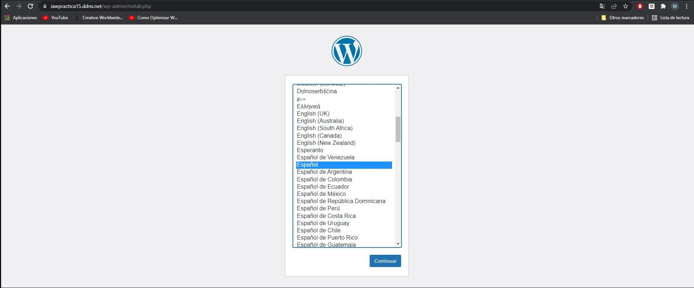
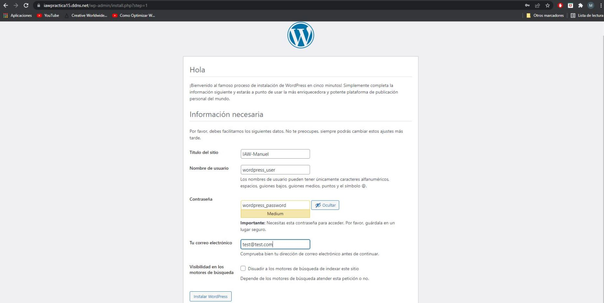
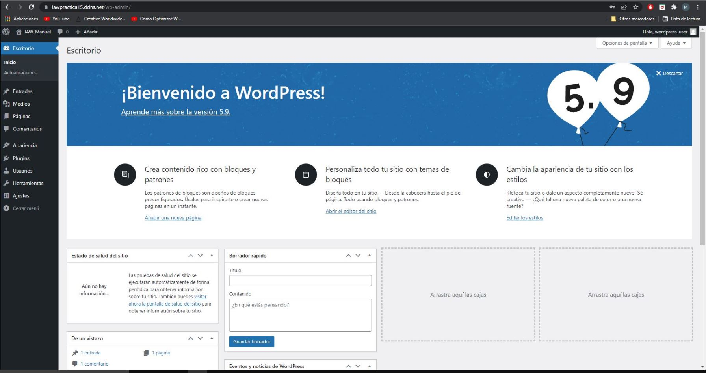

# **Práctica 15**: Instalación de WordPress usando contenedores Docker y Docker Compose.

En esta práctica tendremos que realizar la implantación de un sitio WordPress en Amazon Web Services (AWS) haciendo uso de contenedores Docker y la herramienta Docker Compose.

# Instalación y configuración de Docker y Docker compose

En primer lugar deberemos instalar Docker, para ello ejecutamos el script docker.sh, el cuál descarga Docker, añade nuestro usuario al grupo Docker, inicia el servicio Docker y lo configura para que el servicio se inicie automáticamente.

Antes de continuar es importante actualizar el grupo de Docker, para ello deberemos abrir un terminal y ejecutar:

    newgrp docker
Debemos de instalar en un terminal la herramienta Docker-compose, para ello ejecutamos:

    sudo apt install docker-compose

# Archivo docker-compose.yml para desplegar los servicios de WordPress, MySQL y phpMyAdmin

Docker-compose nos permite crear un archivo de configuracion para que mediante un comando levantemos toda la infraestructura que tenemos creada dentro del archivo docker-compose.yml.

Creamos el archivo docker-compose.yml con los servicios Wordpress, MySQL, PHPMyAdmin y HTTPS-Portal (esta imagen está preparada para permitir que cualquier aplicación web pueda ejecutarse a través de HTTPS) y su configuración.

Para poner en marcha los servicios, ejecutamos en un terminal:

    docker-compose up -d
Si queremos detenerlos el comando es el siguiente:

    docker compose down -v
En el archivo .env se almacenan las variables requeridas para lanzar los servicios del archivo docker-compose.yml

# Comprobamos el acceso
Accedemos a nuestro dominio iawpractica15.ddns.net y nos encontramos con la instalación de Wordpress:

